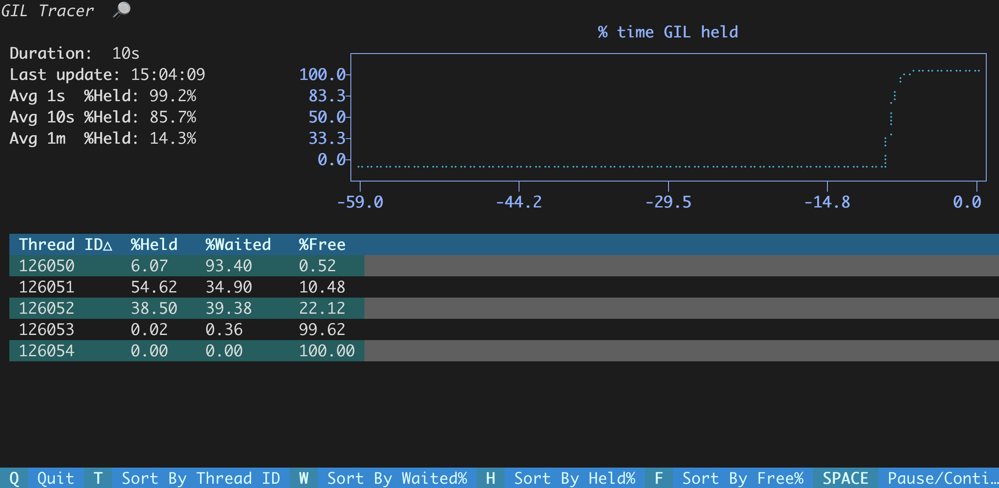

# GIL tracer

🚧 **Work in progress** 🚧 [[task board]](https://github.com/users/gukoff/projects/1)

GIL tracer for CPython. Built on eBPF, works only on Linux. 



## Install dependencies

### To trace with BCC

See the [official `bcc` instructions](https://github.com/iovisor/bcc/blob/master/INSTALL.md).

### To trace with bpftrace

See the [official `bpftrace` instructions](https://github.com/bpftrace/bpftrace/blob/master/INSTALL.md).

A particularly convenient option is to download an [AppImage](https://github.com/bpftrace/bpftrace/blob/master/INSTALL.md#appimage-install). This way you get the latest `bpftrace`.

## Run tracer 

### Trace GIL with BCC event collector

```shell
sudo main.py -p 7031
```

### Trace GIL with bpftrace (no GUI yet)

```shell
sudo bpftrace -p $pid tracing_programs/trace_without_lines.d
```

or

```shell
sudo bpftrace -p $pid tracing_programs/trace_with_lines.d
```
